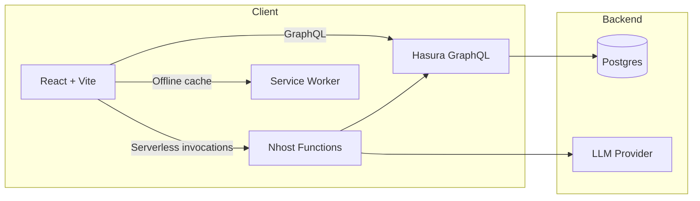

# Teachmo

Full-stack starter wired for Nhost with onboarding, role dashboards, and GraphQL helpers.

## Running the app

1. Copy `.env.example` to `.env` and set at minimum:
   - `VITE_NHOST_BACKEND_URL` for your Nhost project
   - `VITE_API_BASE_URL` if you still target REST fallbacks
2. Install dependencies and start the dev server:

```bash
npm install
npm run dev
```

## Backend (Nhost + Hasura)
- Core schema migration: `nhost/migrations/001_teachmo_core/up.sql`
- Serverless functions: `nhost/functions/health.js`, `nhost/functions/track-event.js`
- Setup docs: `nhost/docs/hasura_setup.md`, `nhost/docs/permissions.md`

Start Nhost locally with `nhost up` and apply migrations; use the docs to track tables and permissions.

## Architecture overview



## Frontend features
- Auth flow with email/password plus prepared social callback handler (`src/pages/AuthCallback.jsx`).
- Onboarding that writes `profiles`, `organizations`, and `schools` (`/onboarding`).
- Role-based routing for parents, teachers, partners, and admins (`src/pages/index.jsx`).
- Dashboards:
  - Parent (`/parent/dashboard`) with events, activities, and messaging previews.
  - Teacher (`/teacher/dashboard`) for classroom and training tracking.
  - Partner (`/partners/dashboard`) for submissions.
  - Admin (`/admin`) for org/school provisioning and role assignment.
- Messaging, events, activities, children, and partner submission operations organized in `src/domains/**` using the shared GraphQL helper at `src/lib/graphql.js`.

## API schema & typed operations

- Schema docs: `docs/api-schema.md`
- Permissions: `nhost/docs/permissions.md`
- GraphQL codegen guidance (typed queries/mutations): `docs/api-schema.md#typed-query-and-mutation-generation`

## Weekly brief operations

- Scheduler docs: `nhost/docs/weekly_briefs_cron.md`
- Weekly brief serverless workflow: `nhost/functions/generate-weekly-briefs.ts`

## Extending events & workflows

Follow the guide in `docs/events-workflows.md` for new calendar events or workflow steps.

## Contributor guidelines

Coding and UX guidelines live in `docs/contributor-guidelines.md`.

## Roadmap: analytics, AI, scalability, integrations

- **District-level insights**: build on `nhost/functions/insights-weekly.ts` and `src/pages/AdminAnalytics.jsx`.
- **Fairness controls**: extend `src/pages/AdminAIGovernance.jsx` policies and audits.
- **Personalized recommendations**: use anonymized engagement signals in `src/components/shared/PersonalizationEngine.jsx`.
- **Scalability**: add load tests for serverless functions and review caching/code-splitting strategies.
- **Integrations**: evaluate school calendars, gradebooks, and parent comms channels to reduce friction.

## Building and deploying

```bash
npm run build
```

For Vercel, keep `VITE_NHOST_BACKEND_URL` set in project settings; the included `vercel.json` handles SPA rewrites.
